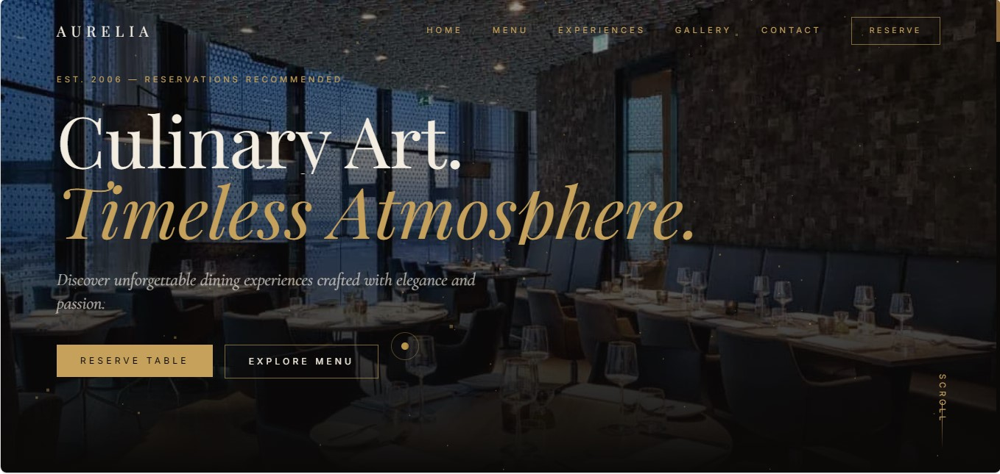
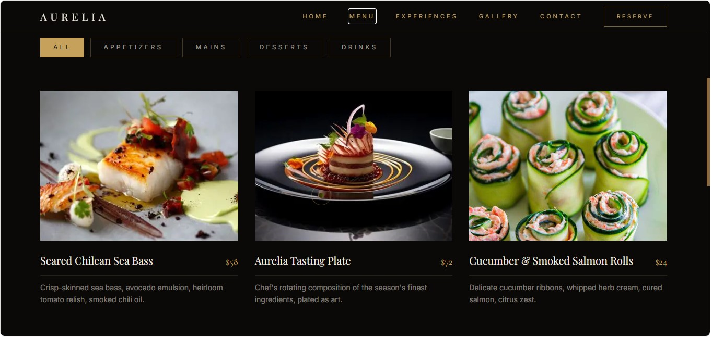
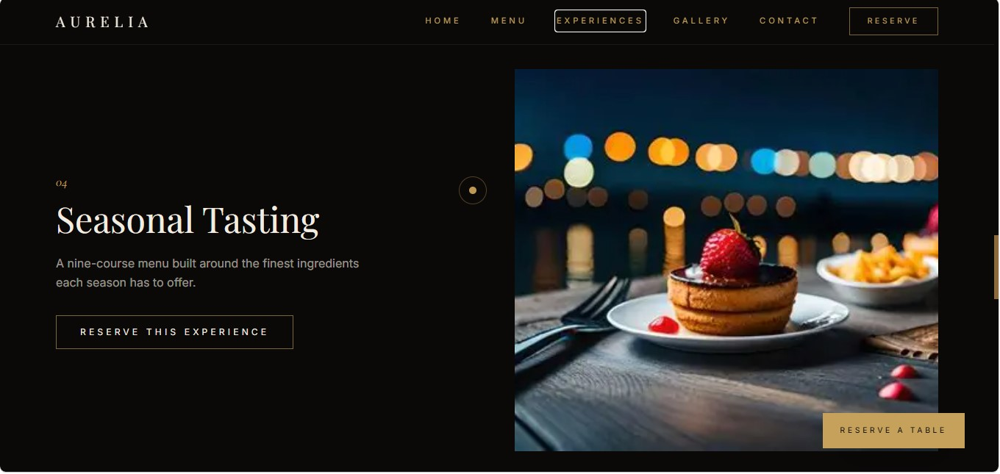
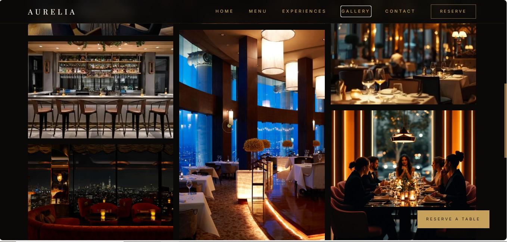
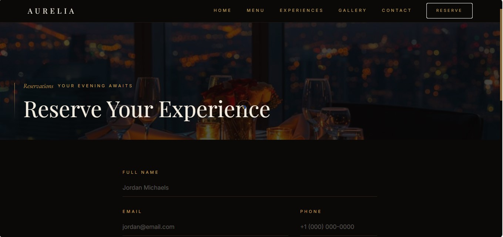
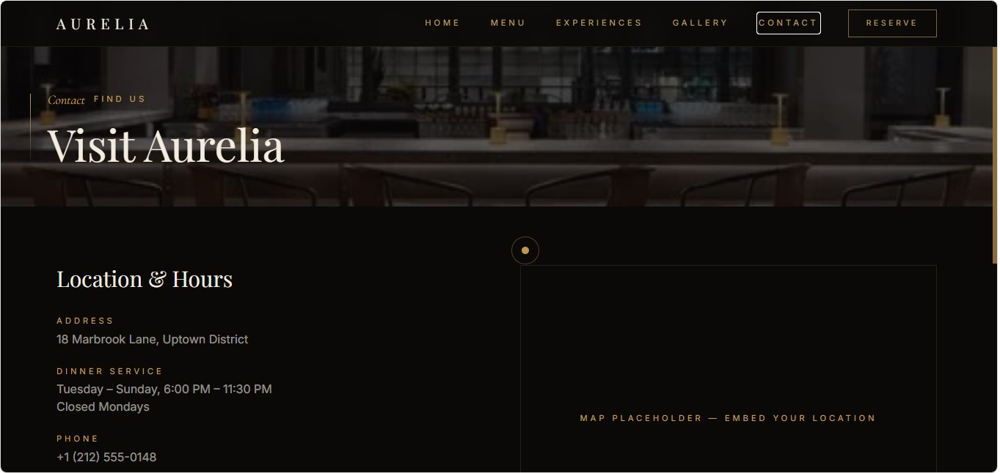
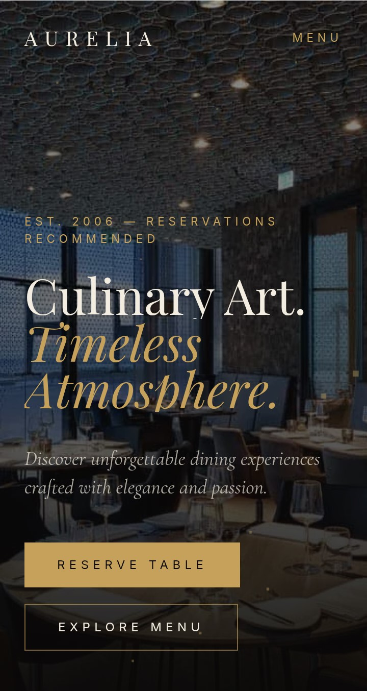

# Aurelia Dining


## Ultra-Premium Fine Dining & Luxury Restaurant Experience Website

Aurelia Dining is a cinematic, luxury restaurant website inspired by world-class fine dining brands, boutique restaurants, and premium hospitality experiences.

The project focuses on elegant storytelling, immersive interactions, sophisticated UI design, and modern frontend engineering to create a refined digital presence for high-end dining establishments.

---

# 🌐 Live Demo

**Website:** https://aurelia-dining.netlify.app/

---

# 📸 Preview

## Desktop Experience

Add screenshots here:














## Mobile Experience



---

# ✨ Features

## Premium User Experience

* Cinematic luxury hero section
* Elegant restaurant storytelling
* Premium typography and visual hierarchy
* Smooth page transitions
* Immersive scrolling experience
* Luxury-focused responsive design


## Interactive Elements

* Three.js ambient ember particle field
* Framer Motion page animations
* Scroll reveal animations
* Interactive menu filtering
* Animated gallery experience
* Smooth user interactions


## Restaurant Functionality

* Signature dishes showcase
* Dining experiences section
* Private events presentation
* Chef's table experience
* Reservation inquiry interface
* Contact and location information


## Technical Features

* Modern React component architecture
* TypeScript type safety
* Responsive layouts
* Form validation with Zod
* React Hook Form integration
* Optimized Vite build pipeline
* Scalable project structure

---

# 🛠 Tech Stack

## Frontend

* React 18
* TypeScript
* Vite
* Tailwind CSS
* React Router


## Animation & 3D Effects

* Framer Motion
* Three.js
* React Three Fiber
* Drei


## Forms & Validation

* React Hook Form
* Zod


## Data Architecture

* TanStack Query ready for API integration


## Deployment

* Netlify / Vercel

---

# 🎨 Design Philosophy

Aurelia Dining was designed to replicate the digital experience of:

* Michelin-star restaurants
* Luxury hospitality brands
* Boutique dining destinations
* Premium lifestyle businesses

The design focuses on:

* Sophisticated visual storytelling
* Premium brand perception
* Elegant minimalism
* Cinematic interactions
* Conversion-focused user journeys

---

# 🎨 Design System

## Color Palette

* Soft Black
* Charcoal
* Warm Ivory
* Champagne Gold
* Deep Burgundy
* Luxury Neutral Tones


## Typography

* Elegant serif headings
* Modern sans-serif body text
* High-end editorial styling


## Signature Experience

The Aurelia Dining experience combines cinematic visuals, subtle motion, and refined interactions to create a premium restaurant identity online.

---

# 📂 Project Structure

```text
src/
│
├── assets/
│   ├── images/
│   └── icons/
│
├── components/
│   ├── Navbar
│   ├── Hero
│   ├── Gallery
│   ├── Loader
│   ├── Experiences
│   ├── Footer
│   └── Shared Components
│
├── pages/
│   ├── Home
│   ├── Menu
│   ├── Experiences
│   ├── Gallery
│   ├── Reservations
│   └── Contact
│
├── hooks/
├── utils/
├── styles/
└── App.tsx
```

---

# 🚀 Getting Started

## Clone Repository

```bash
git clone https://github.com/MalikUsmanAli-dev/Aurelia-dining.git
cd Aurelia-dining
```

## Install Dependencies

```bash
npm install
```

## Start Development Server

```bash
npm run dev
```

Open:

```text
http://localhost:5173
```

---

# 📦 Production Build

```bash
npm run build
npm run preview
```

---

# ⚡ Performance Optimizations

* Vite optimized production builds
* Component-based architecture
* Efficient asset loading
* Lazy loading support
* Responsive image handling
* Optimized animation rendering
* Reduced motion consideration

---

# 📱 Responsive Design

The website is fully optimized for:

✅ Desktop  
✅ Laptop  
✅ Tablet  
✅ Mobile Devices  

---

# ♿ Accessibility

* Semantic HTML structure
* Keyboard-friendly navigation
* Responsive typography
* Accessible form validation
* Reduced motion support

---

# 🚀 Deployment

## Deploy with Netlify or Vercel

Connect the GitHub repository directly through the deployment dashboard.

No additional configuration is required for the frontend build.

---

# 📌 Future Enhancements

* Restaurant reservation management dashboard
* Real-time table availability
* Online ordering system
* Payment integration
* CMS-powered menu management
* Customer accounts
* Email reservation notifications
* AI restaurant concierge assistant

---

# 👨‍💻 Author

**Usman Ali**

Full Stack Developer | React Developer | Software Engineer

GitHub: https://github.com/MalikUsmanAli-dev

Portfolio: https://malik-usman-ali-portfolio.netlify.app/

LinkedIn: https://www.linkedin.com/in/malik-usman-ali-b9b571421

---

# 📄 License

This project is intended for portfolio, educational, and demonstration purposes.

Images used in the project belong to their respective owners and should be replaced with licensed assets before commercial usage.

---

### ⭐ If you like this project, consider giving it a star on GitHub.